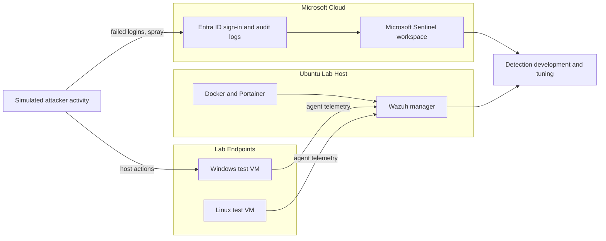

# SOC Detection Lab

> A self-built blue-team lab for developing, testing, and validating detections against real telemetry before they ever touch production.

## Why this lab exists

You cannot write a credible detection against telemetry you have never seen. This lab gives me a safe environment to generate that telemetry: log real sign-in events, simulate attacker behavior, watch what lands in the logs, and confirm a detection fires before I trust it.

It is the proving ground behind my [detection-engineering](https://github.com/edwardjgriggs/detection-engineering) repository. Every rule there was validated here first.

## Architecture at a glance

In plain terms: a mini-PC running Ubuntu hosts my containerized blue-team stack. Wazuh collects host and endpoint telemetry from lab machines. A Microsoft 365 lab tenant streams Entra ID identity logs into a Microsoft Sentinel workspace. Both the cloud SIEM and the on-prem HIDS feed the same workflow: generate activity, observe the logs, build and tune a detection. Remote access to the lab is handled over a private mesh VPN so nothing is exposed to the public internet.

## Components

| Layer | Tooling | Role |
|-------|---------|------|
| Host | Beelink mini-PC, Ubuntu Server | Always-on lab host |
| Runtime | Docker, Portainer | Container management for the blue-team stack |
| HIDS | Wazuh (manager and agents) | Host and endpoint telemetry, file integrity, log analysis |
| Cloud SIEM | Microsoft Sentinel | Identity-focused detection development in KQL |
| Identity | Microsoft 365 / Entra ID lab tenant | Source of sign-in and audit telemetry |
| Access | Mesh VPN | Private remote access, no public exposure |

## Log sources and what they tell me

- **Entra ID sign-in logs:** authentication outcomes, result codes, source IPs. The backbone of every identity detection (brute force, spray, impossible travel).
- **Entra ID audit logs:** directory changes, role assignments, app consent grants.
- **Wazuh agent telemetry:** process activity, authentication events, and file integrity changes on lab endpoints.

## How I generate test telemetry

Detections are only as good as the activity you test them against. I produce telemetry two ways:

1. **Controlled manual activity.** Failed logins across multiple lab accounts from a single host to reproduce a password spray, role changes to trigger audit detections, and similar safe reproductions against accounts I own.
2. **Atomic Red Team (roadmap).** Mapping individual ATT&CK techniques to repeatable tests so each detection has a known trigger and a documented expected result.

All activity is generated against lab-only identities and machines. Nothing in this lab touches production or third-party systems.

## What this demonstrates

- Standing up and operating a SIEM and HIDS end to end, not just querying a pre-built one
- Understanding the full path from raw log to tuned detection
- Hands-on Microsoft Sentinel, Entra ID, Wazuh, Docker, and Linux administration
- The discipline to validate detections before trusting them

## Sanitization note

This repository documents architecture and workflow only. It contains no tenant identifiers, internal IP addresses, VPN keys, hostnames tied to real infrastructure, or credentials. Anyone reproducing this lab should supply their own.

## About

Built and operated by Edward Griggs. Systems administrator and aspiring detection engineer with a federal GovCon background, Security+ certified, SC-200 in progress.

[LinkedIn](https://www.linkedin.com/in/edward-griggs/) · [GitHub](https://github.com/edwardjgriggs)
